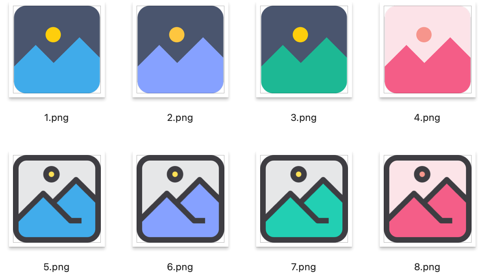

# logo



## 1

```
灰  #49556e
黄  #facd01
蓝  #3badeb
```

## 2

```
紫  #86a7ff
```

## 3

```
绿  #38b594
```

## 4

```
加深顺序
#fde5e8
#f8998d
#f66688
```

## 7

```
淡  #E6E7E8
黄  #FFDE55
绿  #00CCB3
黑  #3E3D42
```